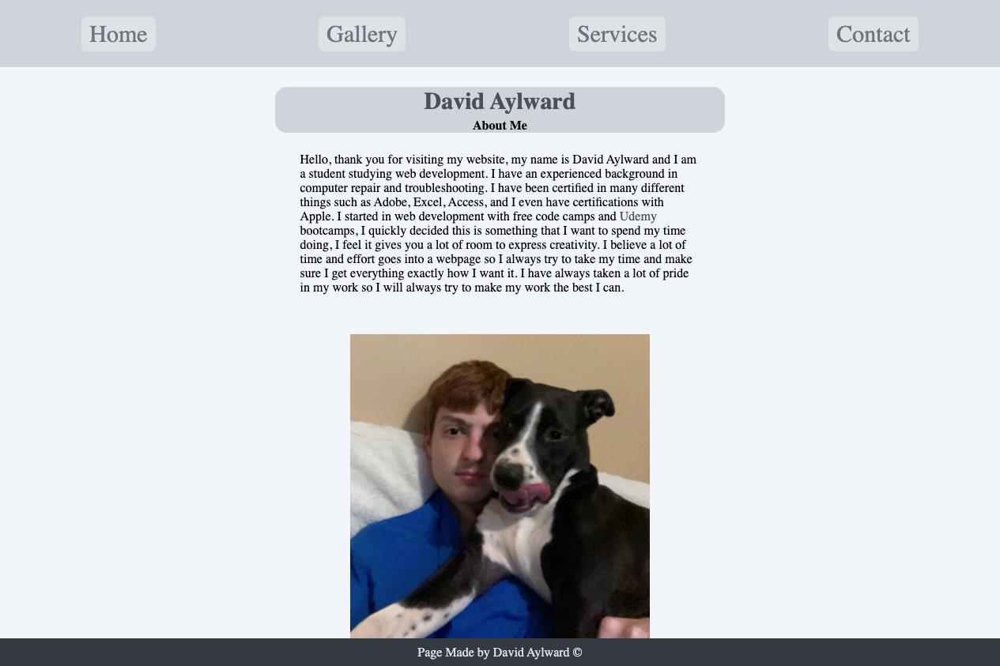

# advanced-css-portfolio

## Table of Contents

1. [About](#about)

2. [Usage](#usage)

3. [My Favorite Code](#my-favorite-code)

4. [Reference Links](#reference-links)

5. [Visuals](#visuals)

<hr>

## About

This website is about me as a web developer. This page is my portfolio which I will show to future employers and/or clients. This page is good to show off my knowledge of the languages as well as show off other projects.

<hr>

## Usage

The usage of this page is to have a better chance at making a successful career out of web development. When applying to jobs or trying to land clients in the freelancing world, this would be the page that I show them. I also have a form at the bottom to collect potential client contact information for free leads.

<hr>

## My Favorite Code
```
 #hding {
  display: flex;
  flex-wrap: wrap;
  flex-direction: column;
  justify-content: center;
  align-items: center;
  background-color: #ced4da;
  width: 45%;
  border-radius: 15px;
  margin: 25px auto;
}
```
<hr>

## Reference Links

https://www.w3schools.com/html/html_forms.asp

## Learn Html Forms


https://css-tricks.com/snippets/css/a-guide-to-flexbox/

## Learn Flexbox


https://flexboxfroggy.com/

## Game to teach Flexbox


https://github.com/DavidAyl

## My GitHub profile

<hr>

## Visuals

Index Page


About Page



Gallery Page


Service Page


Contact Page

